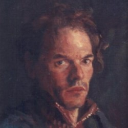

# Paul-talk Discord Archive 
The purpose of this site is to catalog and archive the most important posts of the Paul-talk discord server.

## Links
* [Odysee Channel](https://odysee.com/@Paul-talk:b)
* [Discord](https://discord.gg/pZW2FmCP6B)
* [Twitter](https://twitter.com/Paultalk44)

## Gallery
* [Paul-talk](https://drive.google.com/drive/folders/1w1x_44ukSvgYyMuDaVicCrjo03WmpoUg?usp=sharing)
* [Topias](https://drive.google.com/drive/folders/1w1x_44ukSvgYyMuDaVicCrjo03WmpoUg?usp=sharing)
* [Vladan](https://drive.google.com/drive/folders/1w1x_44ukSvgYyMuDaVicCrjo03WmpoUg?usp=sharing)

## Drawing Exercises
* [01 Beginner Drawing Exercise](https://drive.google.com/drive/folders/1uG9-jfNT7KjP7uyAQZCWCKWDiskgoTi_?usp=sharing)

## Books
* What is Art? - by Paul Rhoads ([pdf](https://github.com/truepainting/truepainting.github.io/raw/main/books/What%20is%20Art%20-%20by%20Paul%20Rhoads%20(Ebook).pdf), [lulu.com](https://www.lulu.com/en/us/shop/paul-rhoads/what-is-art/ebook/product-1qzvpj8m.html))
* Other Books (music) ([Ebooks](https://drive.google.com/drive/folders/1Mh9eqCPpps7_5MkQZ9xjcCDqz7exwFBR?usp=sharing), [lulu.com](https://www.lulu.com/search?contributor=Paul+Rhoads))

## Other
* [Old Twitter Account](https://twitter.com/Paultalktroll)
* [Youtube Drawing Videos Repost](https://www.youtube.com/playlist?list=PLXeMt3ZaTIZxSHxpMy43MwYRZ9NDkF8bQ)
